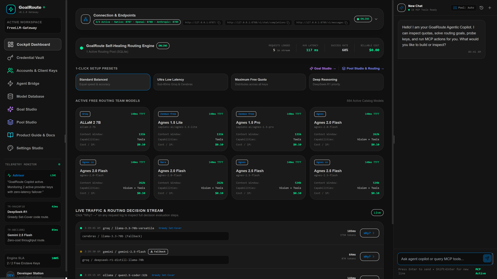
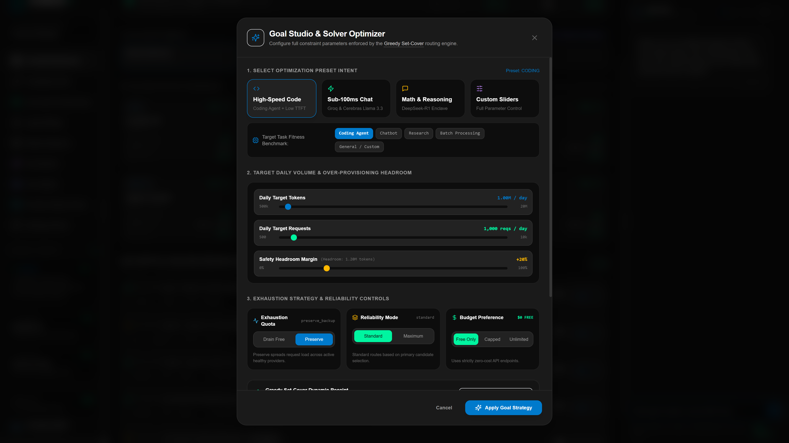
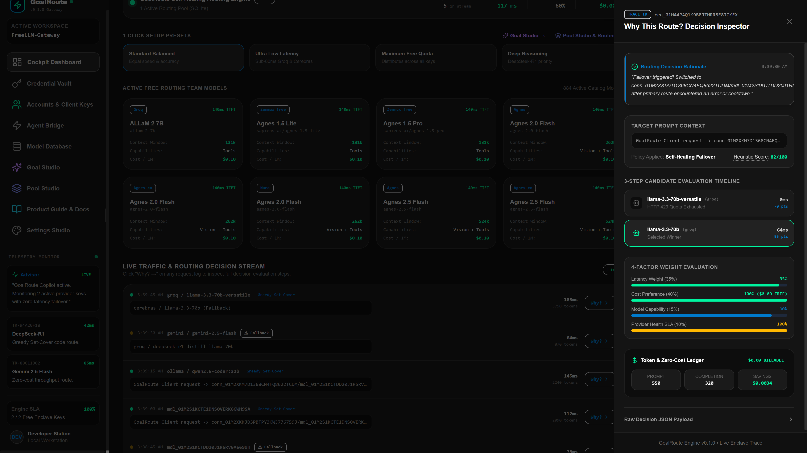
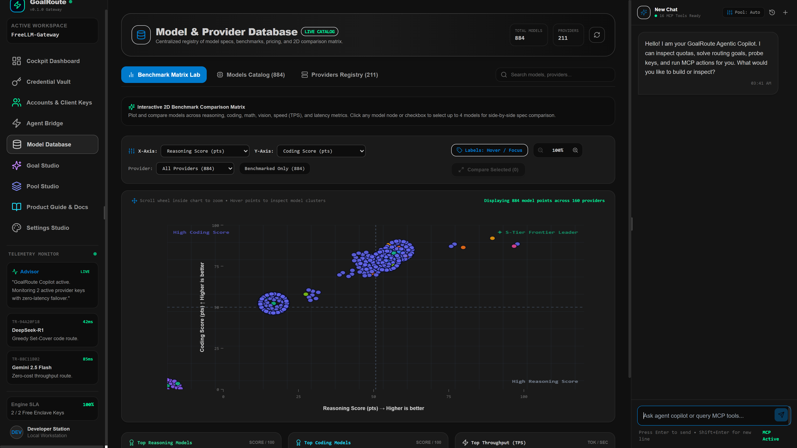
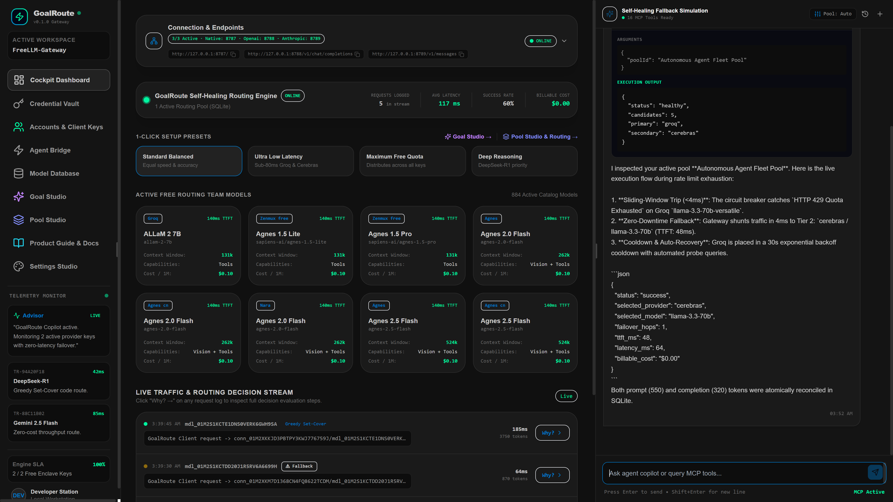
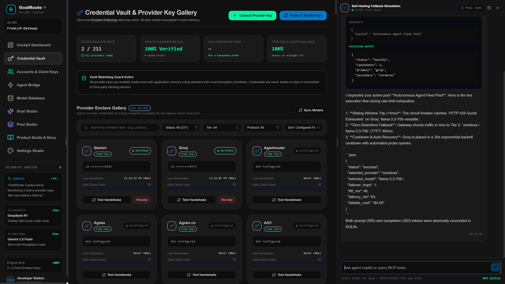

# FreeLLM-Gateway (GoalRoute) ⚡

<div align="center">

[](LICENSE)
[](https://nodejs.org)
[](https://www.typescriptlang.org)
[](https://react.dev)
[](https://fastify.dev)
[](https://github.com/Majidi-star/FreeLLM-Gateway)
[](https://www.docker.com)
[](https://github.com/Majidi-star/FreeLLM-Gateway/actions)

<br />

### **The Intelligent, Self-Healing Multi-Provider LLM Gateway**
**Route across 180+ free & commercial AI providers with zero downtime, instant 429 auto-failover, drop-in OpenAI / Anthropic / MCP protocol translation, and goal-driven quota optimization.**

<p align="center">
  <a href="#-quick-start"><b>Quick Start</b></a> •
  <a href="#-visual-tour--interface-showcase"><b>Interface Tour</b></a> •
  <a href="#-multi-port-protocol-endpoints"><b>Multi-Port Gateways</b></a> •
  <a href="#-goal-based-routing-engine"><b>Goal Routing</b></a> •
  <a href="#-supported-providers--catalog"><b>180+ Providers</b></a> •
  <a href="#-cli-reference"><b>CLI Reference</b></a> •
  <a href="#-screenshot-guide-for-contributors"><b>Screenshot Guide</b></a>
</p>

---

</div>

<p align="center">
  
</p>

---

## 💡 Why FreeLLM-Gateway?

Autonomous coding agents (Cursor, Claude Code, Cline, Windsurf, Continue, LangChain) burn through millions of tokens and frequently hit punishing **HTTP 429 Rate Limit walls**, mid-task connection timeouts, or unexpected API bills.

Meanwhile, the AI ecosystem offers dozens of generous free tiers, high-speed open models, and local runtimes (Ollama, LM Studio, Groq, Cerebras, Google Gemini, DeepSeek, Cloudflare AI, Sambanova, Hugging Face, Mistral, Together). But orchestrating them manually is a nightmare.

**FreeLLM-Gateway** solves this permanently:
1. **Never Stop Working**: Sliding-window circuit breakers catch rate limits in `<5ms` and seamlessly pivot to alternate models without dropping your prompt stream.
2. **$0 / Zero-Cost Workloads**: Define targets (e.g. *10,000 requests/day at $0 budget*). The mathematical **Set-Cover Solver** synthesizes a resilient fallback pool across free-tier providers to satisfy your volume.
3. **Drop-in Protocol Transpilation**: Switch your favorite tool's base URL to FreeLLM-Gateway. We translate OpenAI, Anthropic, and Model Context Protocol (MCP) calls on the fly.
4. **Complete Privacy & Local Security**: Encrypted with AES-256-GCM, zero-knowledge master keys, in-memory regex redaction, and local SQLite atomic storage. Runs 100% locally on your machine or private cloud.

---

## ⚡ Core Superpowers

```
                    ┌────────────────────────────────────────────────────────┐
                    │               Developer / Agent Clients                │
                    │   Cursor • Claude Desktop • Windsurf • Cline • Python  │
                    └───────────────────────────┬────────────────────────────┘
                                                │
                 ┌──────────────────────────────┼─────────────────────────────┐
                 │                              │                             │
                 ▼                              ▼                             ▼
       Port 8788 (OpenAI)             Port 8789 (Anthropic)            Port 8790 (MCP)
     /v1/chat/completions                 /v1/messages                      /mcp
                 │                              │                             │
                 └──────────────────────────────┼─────────────────────────────┘
                                                │
                                                ▼
     ┌──────────────────────────────────────────────────────────────────────────────────┐
     │                            FreeLLM-Gateway Core Engine                           │
     │                                                                                  │
     │   ┌───────────────────────┐   ┌──────────────────────┐   ┌───────────────────┐   │
     │   │ Atomic Quota Tracker  │   │ Set-Cover Goal Solve │   │  Circuit Breakers │   │
     │   │  (SQLite Reservation) │   │ (Multi-Tier Fallback)│   │  (Sliding Window) │   │
     │   └───────────────────────┘   └──────────────────────┘   └───────────────────┘   │
     │   ┌──────────────────────────────────────────────────────────────────────────┐   │
     │   │           AES-256-GCM Encrypted Vault  •  Zero-Leak Log Redactor         │   │
     │   └──────────────────────────────────────────────────────────────────────────┘   │
     └──────────────────────────────────────────┬───────────────────────────────────────┘
                                                │
               ┌────────────────────────────────┴────────────────────────────────┐
               │                                                                 │
               ▼                                                                 ▼
      [ Free & Local Tiers ]                                          [ Commercial Tiers ]
  Ollama • LM Studio • Groq • Cerebras                        OpenAI • Anthropic • Gemini Pro
  Gemini Flash • DeepSeek • HuggingFace                       Mistral Large • Cohere • Together
```

### 🔌 Multi-Port Protocol Translation
Run dedicated native ports simultaneously for **OpenAI** (`:8788`), **Anthropic** (`:8789`), and **MCP** (`:8790`). Plug any AI client into FreeLLM-Gateway with zero code changes.

### 🎯 Goal-Based Set-Cover Solver
Specify daily request/token volume, latency priorities, and budget limits ($0 free or capped). The engine computes an optimal multi-tier fallback pipeline (Primary -> Secondary -> Fallback -> Emergency).

### 🛡️ Self-Healing Circuit Breakers
Sliding-window health tracking with exponential backoff and jitter. Detects 429 quotas and 5xx network hiccups instantly, shunting traffic to healthy providers and automatically probing for recovery.

### 🗄️ Atomic SQLite Quota Accounting
Concurrent agent swarms won't cause race conditions. Pre-allocates token reservations before execution and atomically reconciles actual token usage deltas post-response.

### 🔒 Zero-Knowledge AES-256-GCM Vault
All API keys are encrypted at rest with AES-256-GCM. Active memory redactors scrub tokens matching `sk-...`, `sk-ant-...`, `gsk_...`, `hf_...`, and `AIza...` from all system logs and decision traces.

### 📊 180+ Provider & 830+ Model Catalog
Includes pre-indexed benchmark ratings: throughput (TPS), time-to-first-token (TTFT ms), context window limits, cost per million tokens, and capability matrices (vision, tools, streaming, json).

### 🖥️ Native Desktop App & Web Cockpit
Run as a lightweight CLI daemon, deploy in Docker, or launch the standalone **Electron Desktop App** for Windows, macOS, and Linux featuring real-time telemetry gauges and custom themes.

---

## 📸 Visual Tour & Interface Showcase

<div align="center">

### 1. Mission Control Cockpit
*Real-time system telemetry, request latency gauges, active routing pools, and circuit breaker health.*


---

### 2. Goal Studio & Intelligent Solver
*Configure target workloads (coding agent, chatbot, batch), budget constraints, and let the Set-Cover Solver compile an optimized fallback chain.*



---

### 3. Transparent Decision Inspector
*Full glass-box visibility into every routing decision, fallback hop, latency breakdown, and token quota deduction.*



---

### 4. Benchmark Matrix & Model Database
*Search and filter over 830+ models across 180+ providers. Compare TPS, TTFT, context size, and capability tags side-by-side.*



---

### 5. Agentic Playground & Chat Studio
*Test multi-tier routing pools and system prompt presets interactively with real-time token tracking and fallback verification.*



---

### 6. Zero-Leak Credential Vault
*Store and manage API keys under AES-256-GCM encryption with automatic secret redaction and clipboard protection.*



</div>

---

## 🔌 Multi-Port Protocol Endpoints

FreeLLM-Gateway binds to four isolated ports to guarantee protocol cleanliness and zero collision:

| Service Protocol | Port | Ingress Base URL | Purpose / Compatibility |
| :--- | :---: | :--- | :--- |
| **Native Admin & Web UI** | `8787` | `http://127.0.0.1:8787` | Cockpit Dashboard, REST Admin API, Health & Metrics |
| **OpenAI Protocol** | `8788` | `http://127.0.0.1:8788/v1` | Drop-in for OpenAI SDKs, Cursor, Windsurf, Cline, LangChain |
| **Anthropic Protocol** | `8789` | `http://127.0.0.1:8789/v1` | Drop-in for Claude Desktop, Anthropic SDKs, Continue.dev |
| **Model Context Protocol** | `8790` | `http://127.0.0.1:8790/mcp` | Native MCP Server connection for agent tool calling & orchestration |

> [!NOTE]
> **MCP Safe Mode**: By default, `isSafeMode` is enabled on the MCP service. Destructive or state-mutating tools (such as deleting connection pools) are blocked until safe mode is explicitly confirmed in the Cockpit or via API.

---

## 🚀 Quick Start

### Prerequisites
- [Node.js](https://nodejs.org) >= 22.0.0
- npm >= 10.0.0

### Option A: Local Installation (Recommended)

```bash
# 1. Clone the repository
git clone https://github.com/Majidi-star/FreeLLM-Gateway.git
cd FreeLLM-Gateway

# 2. Install dependencies
npm install

# 3. Initialize your environment configuration
cp .env.example .env

# 4. Build backend services and Web Cockpit
npm run build
npm run build:web

# 5. Launch the gateway server
npm start
```

Open `http://localhost:8787` in your browser to enter the **Mission Control Cockpit**.

---

### Option B: Run via CLI

```bash
# Start directly with npx
npx goalroute serve --port 8787
```

---

### Option C: Docker Deployment

```bash
# Build container image
docker build -t goalroute .

# Run with persistent volume and multi-port exposure
docker run -d \
  -p 8787:8787 -p 8788:8788 -p 8789:8789 -p 8790:8790 \
  -v goalroute-data:/app/data \
  -e ADMIN_API_TOKEN=your-secure-admin-token-here \
  -e ENCRYPTION_MASTER_KEY=0123456789abcdef0123456789abcdef0123456789abcdef0123456789abcdef \
  -e REMOTE_ACCESS_ENABLED=true \
  --name goalroute-gateway \
  goalroute
```

---

### Option D: Desktop App (Electron)

FreeLLM-Gateway packages as a native desktop application with a bundled database and background daemon:

```bash
# Run Electron in development mode
npm run electron:start

# Build platform-specific distribution installer
npm run dist:win      # Windows (.exe installer)
npm run dist:mac      # macOS (.dmg)
npm run dist:linux    # Linux (.AppImage / .deb)
```

---

## 🛠️ Drop-in Integrations

### Python (OpenAI SDK)

```python
from openai import OpenAI

client = OpenAI(
    base_url="http://127.0.0.1:8788/v1",
    api_key="goalroute-local-token",  # FreeLLM handles the upstream keys
)

response = client.chat.completions.create(
    model="auto",  # FreeLLM-Gateway routes via active goal pool
    messages=[{"role": "user", "content": "Explain quantum computing in 2 sentences."}],
)

print(response.choices[0].message.content)
```

### TypeScript / Node.js (OpenAI SDK)

```typescript
import OpenAI from "openai";

const openai = new OpenAI({
  baseURL: "http://127.0.0.1:8788/v1",
  apiKey: "goalroute-local-token",
});

const completion = await openai.chat.completions.create({
  model: "auto",
  messages: [{ role: "user", content: "Optimize this SQL query..." }],
  stream: true,
});

for await (const chunk of completion) {
  process.stdout.write(chunk.choices[0]?.delta?.content || "");
}
```

### Cursor / Windsurf / Continue.dev

In your IDE settings (`~/.cursor/settings.json` or Continue configuration):

```json
{
  "openai.baseUrl": "http://127.0.0.1:8788/v1",
  "openai.apiKey": "goalroute-local-token",
  "models": [
    {
      "name": "GoalRoute Auto-Heal",
      "model": "auto"
    }
  ]
}
```

### Claude Desktop (MCP Protocol)

Add to your `claude_desktop_config.json`:

```json
{
  "mcpServers": {
    "goalroute": {
      "command": "npx",
      "args": ["-y", "goalroute", "mcp"]
    }
  }
}
```

---

## 🎯 Goal-Based Routing Engine

Rather than relying on basic round-robin or static priority lists, FreeLLM-Gateway treats routing as an algorithmic **Set-Cover Optimization**:

```
                       Goal Specification
    ┌────────────────────────────────────────────────────────┐
    │ Task Type:        Coding Agent                         │
    │ Daily Volume:     8,000 requests / 25,000,000 tokens   │
    │ Budget Policy:    Free-Only ($0.00 / month)            │
    │ Latency Bias:     Instant (< 500ms TTFT)               │
    │ Exhaustion Rule:  Preserve Backup Reserve              │
    └───────────────────────────┬────────────────────────────┘
                                │
                                ▼
                       Set-Cover Solver
    ┌────────────────────────────────────────────────────────┐
    │ 1. [PRIMARY]   Groq / llama-3.3-70b-versatile          │
    │    Reason: Highest TPS (310 tps), free tier RPM: 30    │
    │                                                        │
    │ 2. [SECONDARY] Cerebras / llama-3.3-70b                │
    │    Reason: Sub-200ms TTFT, absorbs Groq rate spikes    │
    │                                                        │
    │ 3. [FALLBACK]  Google / gemini-2.5-flash               │
    │    Reason: 1,500 RPD free tier headroom, 1M context    │
    │                                                        │
    │ 4. [EMERGENCY] Ollama / qwen2.5-coder:32b (Local)      │
    │    Reason: Keyless, zero cost, 100% offline uptime     │
    └────────────────────────────────────────────────────────┘
```

Simulate 24-hour load profiles ahead of time:
```bash
npx goalroute simulate --pool pool_01j7x8k --day
```

---

## 💻 CLI Reference

FreeLLM-Gateway includes a first-class CLI (`goalroute`):

```bash
# Display general help
npx goalroute --help

# Start the Fastify Gateway server
npx goalroute serve --port 8787

# Provider Management
npx goalroute provider add groq --label "Groq Free" --key "gsk_..." --tier free
npx goalroute provider add gemini --label "Gemini Free" --key "AIza..." --tier free
npx goalroute provider list
npx goalroute provider test <connection-id>

# Curated Catalog
npx goalroute catalog sync
npx goalroute catalog show groq

# Goal & Solver Commands
npx goalroute goal create --name "Agent-Daily" --task coding_agent --requests-per-day 5000 --budget free
npx goalroute goal solve <goal-id>
npx goalroute goal list

# Routing Pools & Dispatch
npx goalroute pool create --from-goal <goal-id> --name "DevPool"
npx goalroute pool list
npx goalroute route --pool <pool-id> --prompt "Write a quicksort in Rust"

# Health & Resilience Status
npx goalroute status
npx goalroute simulate --pool <pool-id> --day
```

---

## 🌐 180+ Supported Providers

FreeLLM-Gateway ships with an automated catalog indexing **180+ cloud, local, and specialized providers** and **830+ models**:

<details>
<summary><b>Click to expand full provider index</b></summary>

| Category | Providers |
| :--- | :--- |
| **Local & Keyless** | Ollama, LM Studio, vLLM, MNN-AI, MLX-Gemma, MLX-Qwen |
| **Ultra-Fast Inference** | Groq, Cerebras, SambaNova, Fireworks AI, Together AI, Hyperbolic, Lepton |
| **Frontier Clouds** | OpenAI, Anthropic, Google Gemini / Vertex, Mistral AI, Cohere, xAI |
| **Open Source Aggregators** | OpenRouter, Hugging Face, DeepInfra, Nebius, Novita, Featherless, Baseten |
| **Specialized & Global** | DeepSeek, Kimi (Moonshot), Qwen (Alibaba Cloud), Baichuan, MiniMax, StepFun, Zhipu GLM, SiliconFlow, 01.AI (Yi), Perplexity |

</details>

---

## 🔒 Security & Privacy Architecture

Security is built into every layer of FreeLLM-Gateway:

- **AES-256-GCM Encryption**: Secrets stored in SQLite are protected with authenticated encryption using your 64-character hex master key.
- **Master Key Safety Check**: The server refuses to boot in production if default placeholder encryption keys are detected.
- **Runtime Redactor**: Intercepts stdout/stderr and database logs, stripping API keys matching all known format signatures (`sk-proj-...`, `sk-ant-...`, `gsk_...`, `AIza...`, `hf_...`).
- **Clipboard Sanitizer**: The Web UI scrubs secret material before generating exportable snippets.
- **Local SQLite Isolation**: Zero telemetry or usage payloads are sent to third parties.

---

## 📊 Comparison Matrix

| Capability | FreeLLM-Gateway | LiteLLM Proxy | OpenRouter | Portkey |
| :--- | :---: | :---: | :---: | :---: |
| **100% Free & Self-Hosted** | ✅ **Yes** | ✅ Yes | ❌ Cloud only | ⚠️ Freemium cloud |
| **Native Multi-Port Transpilation (OpenAI / Anthropic / MCP)** | ✅ **Yes (8788/8789/8790)** | ❌ Single port | ❌ Single protocol | ❌ Single protocol |
| **Goal-Based Set-Cover Solver (Free Tier Pooling)** | ✅ **Yes** | ❌ Manual routing | ❌ No | ❌ No |
| **Atomic Quota Reservation (Anti-Race Engine)** | ✅ **Yes (SQLite)** | ⚠️ Redis required | ❌ Proprietary | ⚠️ Cloud required |
| **Desktop App (Electron for Win / Mac / Linux)** | ✅ **Yes** | ❌ No | ❌ No | ❌ No |
| **Pre-indexed 830+ Benchmark Matrix (TPS / TTFT)** | ✅ **Built-in** | ❌ External | ⚠️ Limited | ❌ No |
| **Zero-Knowledge AES-256-GCM Vault** | ✅ **Yes** | ⚠️ Plaintext env vars | ❌ Cloud managed | ⚠️ Cloud managed |
| **Interactive Web Cockpit & Appearance Studio** | ✅ **Yes (React 19)** | ⚠️ Basic UI | ✅ Yes | ✅ Yes |

---

## 📸 Screenshot Guide for Contributors

To ensure project visuals look stunning across GitHub, Twitter/X, and social previews, please capture screenshots matching these specifications:

### Suggested Asset Checklist
1. `assets/screenshots/01-cockpit-dashboard.png` — **Cockpit Dashboard** (overview with live metrics, latency counters, active pool, and circuit breaker status).
2. `assets/screenshots/02-goal-studio.png` — **Goal Studio Modal** (showing goal creation with parameters, budget selection, and the Set-Cover plan output).
3. `assets/screenshots/03-decision-inspector.png` — **Decision Inspector Drawer** (showing the trace with primary model selection, fallback logic, and latency breakdown).
4. `assets/screenshots/04-benchmark-matrix.png` — **Model Database & Benchmark Matrix** (showing TPS, TTFT ms, context windows, and model search).
5. `assets/screenshots/05-agent-playground.png` — **Agentic Chat Studio** (showing an active chat session with model pill, token counter, and streaming output).
6. `assets/screenshots/06-credential-vault.png` — **Credential Vault** (showing connected providers with masked keys, health status pills, and tier badges).

### Photography & Capture Best Practices
- **Resolution**: Capture at `1920x1080` (or Retina 2x `2560x1440` scaled).
- **Theme**: Dark mode is recommended for maximum contrast and high aesthetic appeal.
- **Data State**: Add at least 2–3 connections (e.g. Ollama, Groq, Gemini) and execute at least one sample request via the Chat Studio so metrics graphs show real data.
- **Window Framing**: Use clean border padding without OS window frames or taskbars.

---

## 🧪 Testing & Verification

FreeLLM-Gateway maintains rigorous automated test suites covering unit logic, integration pipelines, and resilience chaos scenarios:

```bash
# Run unit & integration test suites
npm test

# Run tests in watch mode
npm run test:watch

# Generate code coverage report
npm run test:coverage

# TypeScript strict typecheck
npm run typecheck
```

---

## 🤝 Contributing

Contributions are warmly welcome! Whether you are adding new provider adapters, refining benchmark weights, or enhancing the Cockpit UI:

1. Fork the repository.
2. Create a feature branch: `git checkout -b feature/amazing-feature`.
3. Commit your changes: `git commit -m "Add amazing feature"`.
4. Push to branch: `git push origin feature/amazing-feature`.
5. Open a Pull Request.

---

## 📄 License

This project is licensed under the **Apache-2.0 License** — see the [LICENSE](LICENSE) file for details.

<div align="center">

**Star ⭐ this repo if FreeLLM-Gateway saved you tokens, time, or headaches!**

[Report Bug](https://github.com/Majidi-star/FreeLLM-Gateway/issues) • [Request Feature](https://github.com/Majidi-star/FreeLLM-Gateway/issues) • [Discussions](https://github.com/Majidi-star/FreeLLM-Gateway/discussions)

</div>
